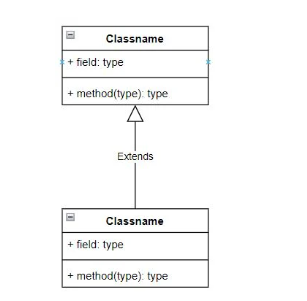
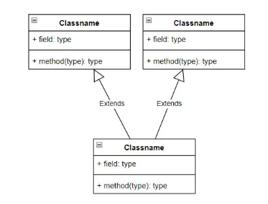
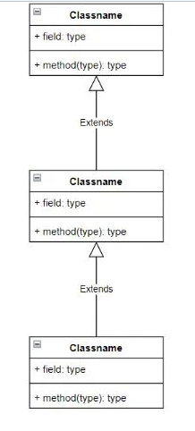
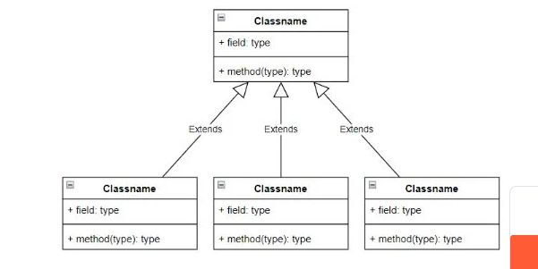
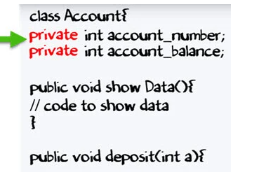

# OBJECT-ORIENTED PROGRAMMING (OOP)

Object-oriented programming is based on the concept of creating a model of the target problem in your programs. Object-oriented programming reduces errors and promotes code reuse.

## The 4 pillars of object-oriented programming

- Abstraction
- inheritance
- polymorphism
- encapsulation

## - Abstraction
In object-oriented programming, abstraction is the process of hiding the details of the implementation from the user and only the functionality will be shown, that is, the user will obtain the information that the object does instead of how it does it and in Java it is done by implementing the abstract classes and implementing interfaces
### example
To understand this concept a little better, let's look at the following example, which will consist of two classes, one for our employee where the file name will be `Employee.java` and then we will have the class that will be our program called `AbstractTest.jav`a For this let's start with the first class:
```java

public abstract class Empleado
{
        private String nombre;
        private String direccion;
        private int numero;

        public Empleado(String nombre, String direccion, int numero)
        {
                System.out.println("Construyendo un empleado");
                this.nombre = nombre;
                this.direccion = direccion;
                this.numero = numero;
        }

        public double pagoComputado()
        {
                System.out.println("Dentro del pago computado al empleado");
                return 0.0;
        }

        public void chequeCorreo()
        {
                System.out.println("Enviando el cheque por correo a "
                                + this.nombre + " " + this.direccion);
        }

        public String toString()
        {
                return nombre + " " + direccion + " " + numero;
        }

        public String getNombre()
        {
                return nombre;
        }

        public String getDireccion()
        {
                return direccion;
        }

        public void setDireccion(String nueva)
        {
                direccion = nueva;
        }

        public int getNumero()
        {
                return numero;
        }
}
```
 
 ## - inheritance

`Inheritance` in Java implies that a superclass or base class inherits its functions and attributes to a subclass or derived class. The reserved word that allows us to perform inheritance between classes is `extends`.
### inheritance types in java
- Simple or single inheritance



- Multiple inheritance



- Multilevel inheritance



- Hierarchical inheritance



## - polymorphism
In object-oriented programming, polymorphism is the ability of the objects of a class to offer different and independent responses depending on the parameters (different implementations) used during their invocation. In other words, the object as an entity can contain values ​​of different types during the execution of the program.
### example 
We can create two different classes: `Cat` and `Dog`, which inherit from the superclass `Animal`
The Animal class has the abstract method `makesound()` that is implemented differently in each of the subclasses (cats and dogs sound differently)
```java
class Animal {
  public void makeSound() {
    System.out.println("Grr...");
  }
}
class Cat extends Animal {
  public void makeSound() {
    System.out.println("Meow");
  }
}
class Dog extends Animal {
  public void makeSound() {
    System.out.println("Woof");
  }
}
```
Since all `Cat` and `Dog` objects are Animal objects, we can do the following
```java
public static void main(String[ ] args) {
  Animal a = new Dog();
  Animal b = new Cat();
}
```


## - encapsulation
`Encapsulation` in `Java` is a mechanism for grouping `variables` (data) and `methods` (code) as a single unit. It is the process of hiding information details and protecting the data and behavior of the object. It is one of the four important concepts of object-oriented programming.
### example
To understand what is encapsulation in detail, consider the following bank account class with deposit and show balance methods

```java 
class Account {
    private int account_number;
    private int account_balance;

    public void show Data() {
        //code to show data 
    }

    public void deposit(int a) {
        if (a < 0) {
            //show error 
        } else
            account_balance = account_balance + a;
    }
}
```

Suppose a hacker managed to access the code to your bank account

You try to deposit an invalid amount (say -100) into your bank account by manipulating the code.
  

If a data member is `private`, it means that it can only be accessed within the same class


## refeneces


- 
- 
- 
- 