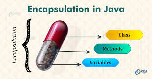
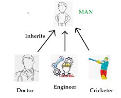
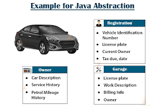

# OOP Pillards in Java

- Object-Oriented Programming (OOP) is a paradigm that emphasizes the use of objects and classes for organizing code. The four main pillars of OOP are Encapsulation, Inheritance, Polymorphism, and Abstraction. These pillars collectively contribute to building flexible, modular, and maintainable software.

## 1.-Encapsulation:
###  Concept:
- Encapsulation is the mechanism of hiding the implementation details and providing only the required information to the user. It keeps the data and the code safe from external interference. In Java, encapsulation is achieved using access modifiers (public, protected, private) and getter and setter methods.
  
### Example:
```java
public class Person {
    private String name;
    private int age;

    public Person(String name, int age) {
        this.name = name;
        this.age = age;
    }

    public String getName() { return name; }
    public void setName(String name) { this.name = name; }

    public int getAge() { return age; }
    public void setAge(int age) { this.age = age; }
}
```
## 2.-Inheritance:
### Concept:
- Inheritance is a mechanism in which one class acquires the properties and behaviors of another class. It supports the concept of hierarchical classification. Inheritance provides reusability, a mechanism that allows us to reuse the fields and methods of the existing class when we create a new class.
  
### Example:
```java
public class Animal {
  public void eat() {
    System.out.println("Animal is eating");
  }
}

public class Dog extends Animal {
  public void bark() {
    System.out.println("Dog is barking");
  }
}

```

## 3.-Polymorphism:
### Concept:
- Polymorphism is the ability of an object to take on many forms. The most common use of polymorphism in OOP occurs when a parent class reference is used to refer to a child class object. Any Java object that can pass more than one IS-A test is considered to be polymorphic.
  
### Example:
```java
public class PolymorphismExample {
  public int add(int a, int b) {
    return a + b;
  }

  public double add(double a, double b) {
    return a + b;
  }
}

```

## 4.-Abstraction:
### Concept:
- Abstraction is a process of hiding the implementation details and showing only functionality to the user. Another way, it shows only essential things to the user and hides the internal details, for example, sending SMS where you type the text and send the message. You don't know the internal processing about the message delivery.
- 
  
### Example:
```java
public abstract class Shape {
  abstract void draw();
}

public class Circle extends Shape {
  void draw() {
    System.out.println("Drawing a circle");
  }
}

```

## Bibliography:
- [4 pillars of Object-Oriented Programming](https://1kevinson.com/4-pillars-of-object-oriented-programming/)
- [Freecodecamp](https://www.freecodecamp.org/news/four-pillars-of-object-oriented-programming/)
