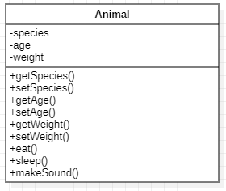
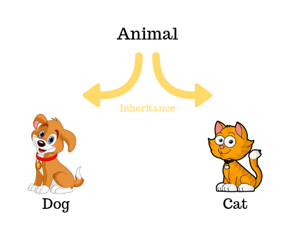

# Object-Oriented programing (OOP) Pillars

## What is Object-oriented programming?


> Object-oriented programming (OOP) is a style of programming characterized by the identification of classes of objects <br> closely linked with the methods (functions) with which they are associated. It also includes ideas of inheritance of attributes and methods.


In other words is a programing paradigm that is based on objects which has data and functionality.<br>
Object-Oriented Programming has four pillars, namely:
- Abstraction
- Encapsulation
- Inheritance
- Polymorphism


## Abstraction

It is the process of defining attributes and methods of a class. for example the ***class Animal***.


### Diagram Class:



### Code example:

The following class Animal has ***attributes*** and ***methods*** (actions) 
```java
public class Animal {

    // Define Attributes
    private String species;
    private int age;
    private double weight;

    // Constructor
    public Animal(String species, int age, double weight) {
        this.species = species;
        this.age = age;
        this.weight = weight;
    }

    // Define Methods
    
    public String getSpecies() {
        return species;
    }

    public void setSpecies(String species) {
        this.species = species;
    }

    public int getAge() {
        return age;
    }

    public void setAge(int age) {
        this.age = age;
    }

    public double getWeight() {
        return weight;
    }

    public void setWeight(double weight) {
        this.weight = weight;
    }

    // Method to make the animal eat
    public void eat() {
        System.out.println(species + " is eating.");
    }

    // Method to make the animal sleep
    public void sleep() {
        System.out.println(species + " is sleeping.");
    }

    // Method to make the animal make a sound
    public void makeSound() {
        System.out.println(species + " is making a sound.");
    }
}

```

## Encapsulation
 
It is when an object in the code has restricted parts and **prevent access** to other objects or other parts of the code.<br>
In other words, an object in the code has private its attributes and/or its methods.<br>
For example. An Object could have **private** its **attributes** and the keys to these are the ***setters*** and ***getters*** methods


### Diagram Class:


### Code example:

In the following code, **attributes** are **private** and the way they can change anb be obtained is through their ***getters*** and ***setters*** methods.

```java
public class Animal {

    // Private Attributes
    private String species;
    private int age;
    private double weight;

    // Constructor
    public Animal(String species, int age, double weight) {
        this.species = species;
        this.age = age;
        this.weight = weight;
    }

    // The following Methods as keys

    // Getter and Setter for species
    public String getSpecies() {
        return species;
    }

    public void setSpecies(String species) {
        this.species = species;
    }

    // Getter and Setter for Age
    
    public int getAge() {
        return age;
    }

    public void setAge(int age) {
        this.age = age;
    }

    // Getter and Setter for Weight
    
    public double getWeight() {
        return weight;
    }

    public void setWeight(double weight) {
        this.weight = weight;
    }
    
}

```

## Inheritance
This happens when children classes inherit attributes and methods from the parent classes. <br>



### Diagram Class:


### Code example:

In this example, there is a parent class **Animal** and its children classes **Fish**, **Cat** and **Bird** 

The following class **Animal** is the ***parent*** class.

```java
public class Animal {

    // Define Attributes
    private String species;
    private int age;
    private double weight;

    // Constructor
    public Animal(String species, int age, double weight) {
        this.species = species;
        this.age = age;
        this.weight = weight;
    }

    // Define Methods

    public String getSpecies() {
        return species;
    }

    public void setSpecies(String species) {
        this.species = species;
    }

    public int getAge() {
        return age;
    }

    public void setAge(int age) {
        this.age = age;
    }

    public double getWeight() {
        return weight;
    }

    public void setWeight(double weight) {
        this.weight = weight;
    }
}
```
Children classes:

````java
public class Cat extends Animal {

    // Own attributes
    private boolean isIndoor;

    // Constructor for Cat
    public Cat(String species, int age, double weight, boolean isIndoor) {
        // Call the constructor of the superclass (Animal)
        super(species, age, weight);
        this.isIndoor = isIndoor;
    }

    // Getter and Setter for isIndoor
    public boolean isIndoor() {
        return isIndoor;
    }

    public void setIndoor(boolean indoor) {
        isIndoor = indoor;
    }

    // Additional method specific to Cat
    public void purr() {
        System.out.println("The cat is purring.");
    }
}

````

````java
public class Bird extends Animal {

    // Own attributes
    private boolean canFly;

    // Constructor for Bird
    public Bird(String species, int age, double weight, boolean canFly) {
        // Call the constructor of the superclass (Animal)
        super(species, age, weight);
        this.canFly = canFly;
    }

    // Getter and Setter for canFly
    public boolean canFly() {
        return canFly;
    }

    public void setCanFly(boolean canFly) {
        this.canFly = canFly;
    }

    // Additional method specific to Bird
    public void sing() {
        System.out.println("The bird is singing.");
    }
}

````
````java
public class Fish extends Animal {

    // Own attributes
    private String habitat;

    // Constructor for Fish
    public Fish(String species, int age, double weight, String habitat) {
        // Call the constructor of the superclass (Animal)
        super(species, age, weight);
        this.habitat = habitat;
    }

    // Getter and Setter for habitat
    public String getHabitat() {
        return habitat;
    }

    public void setHabitat(String habitat) {
        this.habitat = habitat;
    }

    // Additional method specific to Fish
    public void swim() {
        System.out.println("The fish is swimming.");
    }
}

````

Main class:
````java
public class Main {

    public static void main(String[] args) {
        //Instance of class
        Dog myDog = new Dog("Dog", 3, 15.5, "Labrador");
        Cat myCat = new Cat("Cat", 2, 7.0, true);
        Bird myBird = new Bird("Bird", 1, 0.5, true);
        Fish myFish = new Fish("Fish", 1, 0.2, "Aquarium");

        System.out.println("Dog Weight: " + myDog.getWeight() + " kg");
        System.out.println("Cat Weight: " + myCat.getWeight() + " kg");
        System.out.println("Bird Weight: " + myBird.getWeight() + " kg");
        System.out.println("Fish Weight: " + myFish.getWeight() + " kg");
    }
}

````

In the examples above, you can see that each child class uses attributes and methods from its parent class.

## Polymorphism
Gives same instructions to several objects so that they respond in different ways.


### Diagram Class:


### Code example:

In this example, there is a parent class **Animal** and its children classes **Fish**, **Cat** and **Bird**

```java
public class Animal {

    // Define Attributes
    private String species;
    private int age;
    private double weight;

    // Constructor
    public Animal(String species, int age, double weight) {
        this.species = species;
        this.age = age;
        this.weight = weight;
    }

    // Define Methods

    public String getSpecies() {
        return species;
    }

    public void setSpecies(String species) {
        this.species = species;
    }

    public int getAge() {
        return age;
    }

    public void setAge(int age) {
        this.age = age;
    }

    public double getWeight() {
        return weight;
    }

    public void setWeight(double weight) {
        this.weight = weight;
    }

    // Method to make the animal make a sound
    public void makeSound() {
        System.out.println(species + " is making a sound.");
    }
}
```
Children classes:

````java
public class Cat extends Animal {

    // Constructor for Cat
    public Cat(String species, int age, double weight) {
        // Call the constructor of the superclass (Animal)
        super(species, age, weight);
        this.isIndoor = isIndoor;
    }
    
    // Override the makeSound method from the superclass
    @Override
    public void makeSound() {
        System.out.println("The cat is meowing.");
    }
}

````

````java
public class Bird extends Animal {

    // Constructor for Bird
    public Bird(String species, int age, double weight) {
        // Call the constructor of the superclass (Animal)
        super(species, age, weight);
    }
    
    // Override the makeSound method from the superclass
    @Override
    public void makeSound() {
        System.out.println("The bird is chirping.");
    }
}

````
````java
public class Fish extends Animal {
    
    // Constructor for Fish
    public Fish(String species, int age, double weight) {
        // Call the constructor of the superclass (Animal)
        super(species, age, weight);
        this.habitat = habitat;
    }

    // Override the makeSound method from the superclass
    @Override
    public void makeSound() {
        System.out.println("The fish is bubbling.");
    }
}

````
In the code above, you can see that each child class is ***overriding*** the **makeSound** method from their parent class **Animal**.

## Research Sources:
- https://www.freecodecamp.org/news/four-pillars-of-object-oriented-programming/
- https://www.geeksforgeeks.org/four-main-object-oriented-programming-concepts-of-java/
- https://www.gartner.com/en/information-technology/glossary/oop-object-oriented-programming#:~:text=Object%2Doriented%20programming%20(OOP),inheritance%20of%20attributes%20and%20methods.
- https://medium.com/javarevisited/four-pillars-in-java-2a5a38838756