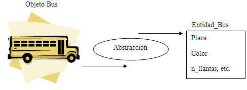
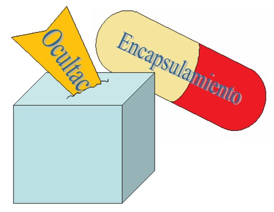
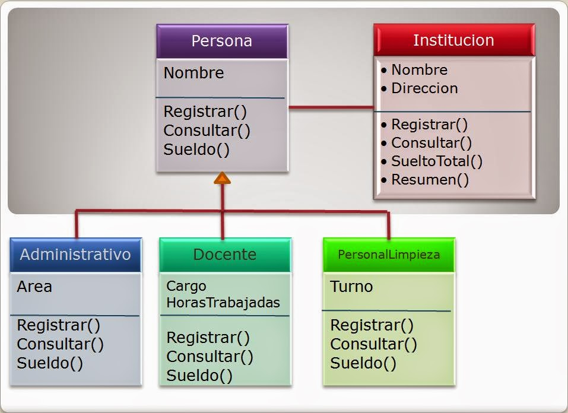
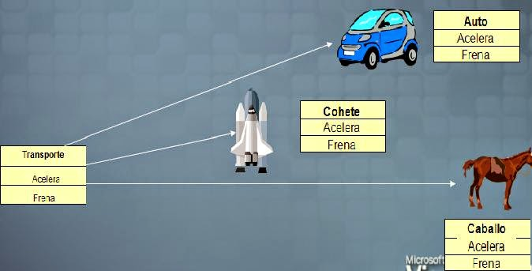

# Assignment 5

## Introduction to Java


**Java is a general-purpose, typed, object-oriented programming language**
Java was born as a programming language that could be multiplatform and multidevice, under the **“Write Once Run Anywhere”** (WORA) paradigm.
### - Classes
A class in Java programming language can be understood as a prototype that defines the variables (which differentiates it from others) and methods (the actions that it may perform) common to a certain type of instances.
### - Objects
An instance of a class. Objects have state (attributes) and behavior (methods).
### - Method
A method is a block of code that performs a specific action. Methods are defined in a class and invoked in objects.
### - Overload: 
Define multiple methods with the same name but with different types or numbers of parameters.
### - Overwrite: 
Implement a method on a subclass that is already defined in the superclass, with the same signature.

--------------------------------------------------------------------------------------------------------------
## The 4 OOP Pillars 

* Abstraction
* Encapsulation 
* Inheritance
* Polymorphism

1. **Abstraction** It is the process by which all information that is not relevant in a particular context is discarded by emphasizing some of the details or properties of objects.
     Abstraction depends mainly on the interest of the observer, allowing for very different abstractions of the same reality, because of this some classify it somewhat subjectively.
      
     From a software development point of view, we can see that with a class we can make an abstraction of a real-world entity.

    * Example
   ```
      // Abstract class
      public abstract class Car {
      public abstract void stop();
      }
      // Concrete class
      public class Honda extends Car {
      // Hiding implementation details
      @Override public void stop()
      {
      System.out.println("Honda::Stop");
      System.out.println(
      "Mechanism to stop the car using break");
      }
      }
      public class Main {
      public static void main(String args[]) {
          Car obj = new Honda(); // Car object =>contents of Honda
          obj.stop(); // call the method
          }
      }

2. **Encapsulation** allows us to control who can see and use the various internal modules of our system. In terms of classes, with encapsulation we define access to class members.
      
   * Example 
   ```
          public class Car 
          {

              // privatevariable 
              private String name; 
	 
              // gettermethodforname 
              public String getName() 
          { 
               return name; 
		 
          } 
	 
              // settermethodforname 
              public void setName(String name) 
          { 
               this.name = name; 
          } 

          }
   public class Test
   {
   public static void main(String[] args)
   {

			// creatinginstanceoftheencapsulatedclass 
			Car car = newCar(); 
		 
			// settingvalueinthenamemember 
			car.setName("Honda"); 
		 
			// gettingvalueofthenamemember 
			System.out.println(car.getName());
   }
   }


3. **Inheritance** It is a special relationship between two classes, the base class and the derived class, where the derived class gains the ability to use certain properties and functionalities of the base class, even being able to substitute functionality of the base class. The idea is that the derived class "inherits" some of the characteristics of the base class.

    * **Abstract Class**:
      An abstract class in Java is a class that cannot be instantiated directly and is often used as a base class for other concrete classes. It can contain abstract methods, which are declared but not implemented in the abstract class.
    * **Interface:** 
      In Java, an interface is an abstract type that defines a set of methods and constants that must be implemented by the classes that implement it. Interfaces are used to specify the behavior of a class without specifying how that behavior is implemented.
5. **Polymorphism** is the ability to perform many things in many ways. The word Polymorphism is from two different Greek words - poly and morphs. “Poly” means many, and “Morphs” means forms. So polymorphism means many forms.
   This means that there can be many messages with the same name, in different classes. Each class responds to the message with its own code (or method)

## Bibliography
* Corona, A. V. (2020). Platzi. Obtenido de https://platzi.com/tutoriales/1474-oop/6108-4- elementos-y-pilares-basicos-de-la-programacion-orientada-a-objetos-poo/
* Gavilan, F. (2018). GavilanCH. Obtenido de https://gavilanch.wordpress.com/2018/07/05/los-4-pilares-de-la-programacion-orientada-a-objetos/
* lavanyaprasanth. (s.f.). Geeksforgeeks. Obtenido de https://www.geeksforgeeks.org/four-main-object-oriented-programming-concepts-of-java/
* Manual Web. (s.f.). Manual Web. Obtenido de https://www.manualweb.net/java/conceptos-basicos-java/
