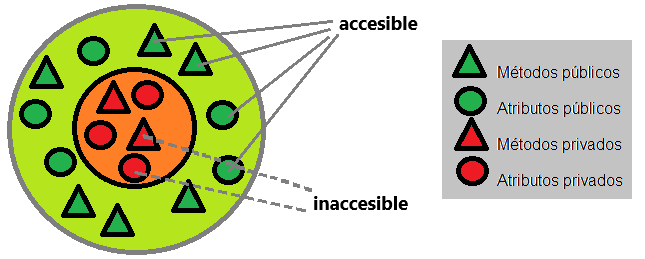
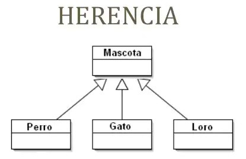
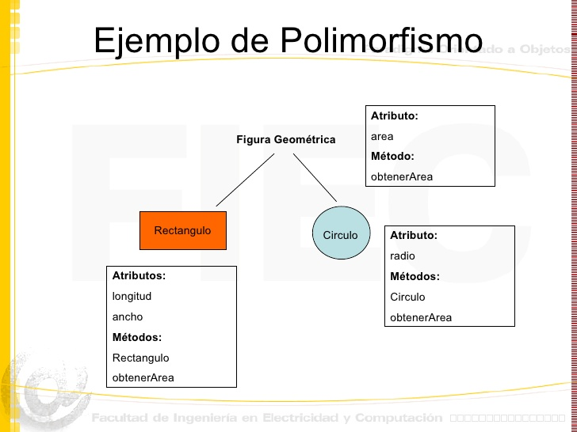
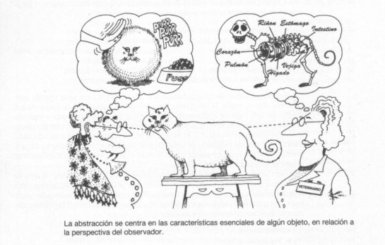

# OOP Pillards in Java

- Object-Oriented Programming (OOP) is a programming approach that is based on the creation and manipulation of "
  objects." These objects are entities that combine data and behaviors into a single package.
- In OOP, objects have attributes that represent their characteristics or properties, and methods that define the
  actions they can perform. Classes are used to define the structure and behavior of objects. A class acts as a template
  or model from which individual objects are created with unique characteristics.
- For example, consider an application that manages vehicles. We could define a "Car" class with attributes such as "
  brand," "model," and "color," and methods such as "start" and "stop." Then, we can create multiple objects of the "
  Car" class, each with its own characteristics and the ability to perform the same actions.
- OOP organizes code in a modular way by combining data and behaviors into objects, making it easier to create,
  maintain, and reuse code in software ****development.

## Encapsulation:
### Concept: 
- Encapsulation involves hiding the internal details of an object and restricting direct access to its data. This is achieved using access modifiers (such as public, private, protected) and providing getter and setter methods to access and modify an object's data in a controlled manner.

### Example:
```java
public class Car {
    private String brand;
    private String model;

    // Getter and setter methods
    public String getBrand() {
        return brand;
    }

    public void setBrand(String brand) {
        this.brand = brand;
    }

    public String getModel() {
        return model;
    }

    public void setModel(String model) {
        this.model = model;
    }
}
```
## Inheritance:
### Concept: 
- Inheritance allows a class to inherit the attributes and methods of another class. The inheriting class is known as a subclass or derived class, and the class from which it inherits is called a superclass or base class.

### Example:
```java
public class Vehicle {
    // Attributes and methods common to all vehicles
}

public class Car extends Vehicle {
    // Attributes and methods specific to cars
}
```

## Polymorphism:
### Concept: 
- Polymorphism allows an object to take multiple forms. It can refer to objects of its base classes or derived classes, and it can behave differently depending on the context.

### Example:
```java
public interface Animal {
    void makeSound();
}

public class Dog implements Animal {
    public void makeSound() {
        System.out.println("Woof woof");
    }
}

public class Cat implements Animal {
    public void makeSound() {
        System.out.println("Meow meow");
    }
}
```

## Abstraction:
### Concept: 
- Abstraction involves simplifying a complex system by breaking it down into smaller parts and focusing on the relevant aspects for a particular purpose. Abstract classes and interfaces are tools used to achieve abstraction in Java.

### Example:
```java
// Abstract class
public abstract class Shape {
  abstract void draw();
}

// Concrete class extending the abstract class
public class Circle extends Shape {
  void draw() {
    System.out.println("Drawing a circle");
  }
}
```

## Bibliography:
- [OpenWebinars](https://openwebinars.net/blog/introduccion-a-poo-en-java-objetos-y-clases/)
- [EDteam](https://ed.team/blog/que-es-la-programacion-orientada-a-objetos-poo)