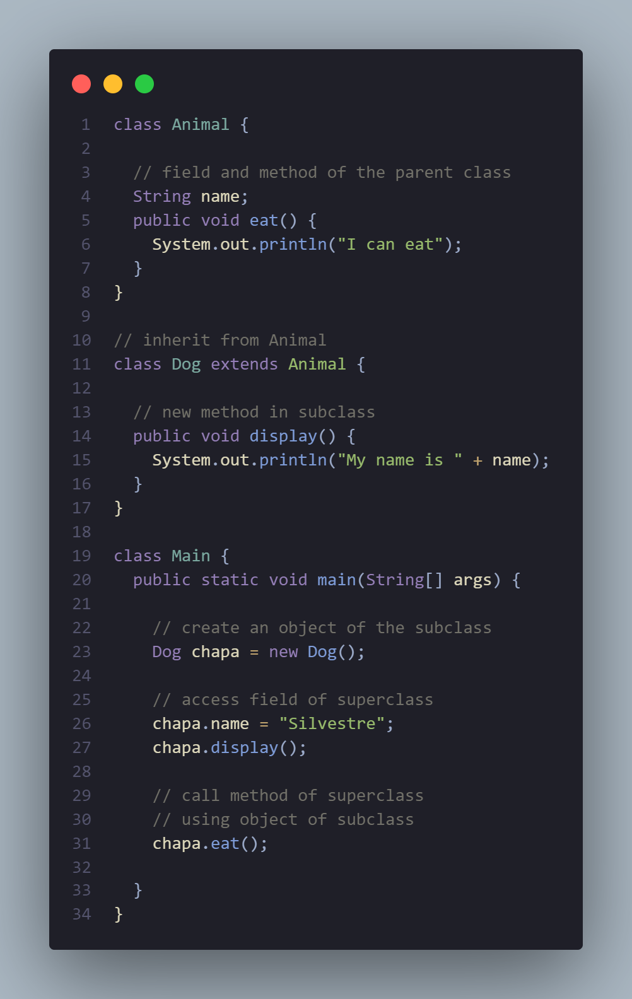

# OOP pillars
> [!IMPORTANT]
> Object-Oriented Programming (OOP) is a programming paradigm **focused on representing data through _objects_ and _classes_**, with JAVA serving as a notable example. In this paradigm, classes act as templates, offering abstraction without memory consumption. Objects, instances of classes, are tangible entities that occupy memory space.

### Access Modifier
The access modifier of a method dictates its visibility to other classes and controls access levels. Common modifiers are   `public` (accessible by any class), `private` (restricted to its own class), `protected` (accessible within its package and by subclasses), and `package-private` (default, limiting access to classes within the same package).

### The Return Type
The return type in a method specifies the data type of the value the method will provide after execution. If the method doesn't yield any value, the return type is designated as `void`. Otherwise, it can be any data type such as **_int_, _String_, _boolean_, or any _object type_.**

### Method Name
The method name, acting as the identifier for reference, should adhere to language-specific naming conventions. **Typically starting with a _lowercase letter_**, it often takes the form of a verb or verb phrase **indicating the _operation performed by the method_**, like `calculateTotal`, `printDetails`, or `isEmpty`.

### Parameter List
Parameters in a method are a sequence of variables enclosed in parentheses `()`, serving as **_inputs for the method's operation_**. Each parameter is defined with a data type and an identifier name, and multiple parameters are separated by commas.

### Exception List
Certain programming languages, such as Java, permit methods to declare a list of exceptions they may throw during execution. This list, part of the method signature, is specified with the `throws` keyword, followed by the types of exceptions. **It serves to notify method callers about _potential exceptions_**, prompting them to include appropriate exception-handling code.

### Method Body
The method body, enclosed in braces `{}`, **houses the code that defines the method's functionality**. Comprising a sequence of statements, this code is executed when the method is called. Within the method body, the actual logic is implemented, involving manipulation of variables, invocation of other methods, execution of loops, and the generation of a return value if applicable.

> [!NOTE]
> OOPS moves around its four most important pillars. These are; **Inheritance, Polymorphism, Abstraction, and Encapsulation**.
# Inheritance
### Types of Inheritance
> There are a total of five types of Inheritance in OOPS.
1. Single Inheritance
   * In single inheritance, a single subclass extends from a single superclass.
   
     
2. Multilevel  Inheritance
   * In multilevel inheritance, a subclass extends from a superclass and then the same subclass acts as a superclass for another class. For example
   
     
3. Hierarchical  Inheritance
   * In hierarchical inheritance, multiple subclasses extend from a single superclass. For example
   
     
4. Multiple  Inheritance
   * In multiple inheritance, a single subclass extends from multiple superclasses. For example
   
     
> [!NOTE]
> Java doesn't support multiple inheritance. However, we can achieve multiple inheritance using interfaces.

5. Hybrid  Inheritance
   * Hybrid inheritance is a combination of two or more types of inheritance. For example
   
     
> Here, we have combined hierarchical and multiple inheritance to form a hybrid inheritance.

### Advantages of Inheritance
* Code reusability
* We can achieve Polymorphism using Inheritance.
### Disadvantages of Inheritance
* The child class and the parent class are tightly coupled. Any changes in the parent class equally affect all the child classes.
### Example Code

### Output 
> My name is Silvestre     
> I can eat

In the above example, we have derived a subclass `Dog` from superclass `Animal`. Notice the statements

> chapa.name = "Silvestre";  
> chapa.eat();

Here, `chapa` is an object of `Dog`. However, `name` and `eat()` are the members of the `Animal` class. Since `Dog` inherits the field and method from `Animal`, we are able to access the field and method using the object of the `Dog`.

# Polymorphism
> Poly means many, and morphism means forms. We know that Water also exists in multiple states, such as Solid, Liquid, and Gas. So Water shows Polymorphism. In Java, we can achieve Polymorphism using methods. There are two types of Polymorphism  that JAVA supports.
### Example code

### Output
> Rendering Square...     
Rendering Circle...

In the above example, we have created a superclass: `Polygon` and two subclasses: `Square` and `Circle`. Notice the use of the `render()` method.
The main purpose of the `render()` method is to render the shape. However, the process of rendering a square is different from the process of rendering a circle.
Hence, the `render()` method behaves differently in different classes. Or, we can say render`render()` is polymorphic.

### Compile-time Polymorphism
Compile-time polymorphism, also known as static or early binding, occurs when the association between an object and its functionality is determined at compile time. In Java, this is achieved through **_method overloading_**, where multiple methods in a class share the same name but have different parameter lists. During compilation, Java determines which method to call based on the method signatures, enabling the selection of the appropriate method at compile time. This is an example of compile-time polymorphism, as opposed to runtime polymorphism, which occurs dynamically during program execution.
### Example Compile code

### Output
> 5     
5.0

> [!NOTE]
> The compiler handles Compile-time Polymorphism.

### Runtime polymorphism
Runtime polymorphism, also known as dynamic or late binding, occurs when an object is associated with its functionality during runtime. In Java, this is achieved through method overriding, where a child class provides a specific implementation of a method declared in its parent class. During program execution, the Java Virtual Machine (JVM) dynamically determines the proper method to call based on the actual object type. Unlike compile-time polymorphism, which is determined at compile time, runtime polymorphism allows for flexibility in method selection during program execution. This is exemplified in situations where a child class overrides a method inherited from its parent class.

### Example Runtime code

### Output
> Method 2

> [!NOTE]
> JVM handles the runtime polymorphism.

### Differences between both 

# Abstraction
> Abstraction in Java is the process in which we only show essential details/functionality to the user. The non-essential implementation details are not displayed to the user.                                              

> Simple Example to understand Abstraction:
Television remote control is an excellent example of abstraction. It simplifies the interaction with a TV by hiding the complexity behind simple buttons and symbols, making it easy without needing to understand the technical details of how the TV functions.

Data Abstraction may also be defined as the process of **identifying only the required characteristics of an object _ignoring the irrelevant details_**. The properties and behaviours of an object differentiate it from other objects of similar type and also help in classifying/grouping the objects.
Consider a real-life example of a man driving a car. The man only knows that pressing the accelerators will increase the speed of a car or applying brakes will stop the car, but he does not know how on pressing the accelerator the speed is actually increasing, he does not know about the inner mechanism of the car or the implementation of the accelerator, brakes, etc. in the car. This is what abstraction is.

### Java Abstract classes and Java Abstract methods
* An abstract class is a class that is declared with an `abstract` keyword.
* An abstract method is a method that is **_declared without implementation_**.
* An abstract class may or may not have all abstract methods. **_Some of them can be concrete methods_**.
* A method-defined abstract must always be redefined in the subclass, thus making overriding compulsory or making the subclass itself abstract.
* Any class that contains one or more abstract methods must also be declared with an `abstract` keyword.
* **_There can be no object of an abstract class_**. That is, an abstract class can not be directly instantiated with the new operator.
* An abstract class can have parameterized constructors and the default constructor is always present in an abstract class.

### Algorithm to implement abstraction in Java
*  Determine the classes or interfaces that will be part of the **abstraction**.
*  Create an `abstract` class or `interface` that defines the common behaviours and properties of these classes.
*  Define abstract methods within the `abstract` class or `interface` that do not have any implementation details.
*  Implement concrete classes that extend the `abstract` class or implement the `interface`.
*  Override the `abstract` methods in the concrete classes to provide their specific implementations.
*  Use the concrete classes to implement the program logic.

### When to use abstract classes and abstract methods?
In certain scenarios, it is **beneficial to create a superclass that outlines the structure of an abstraction without providing a _complete implementation_ of each method**. This approach allows for the definition of a generalization form in the superclass, shared by all subclasses, leaving it to each subclass to provide specific details. Using the example of shapes in a computer-aided design or game simulation, a base type "shape" may have common attributes like color and size, with specific shapes such as circle, square, and triangle inheriting from it. Each subclass can add additional characteristics and behaviors, showcasing a type hierarchy that captures both similarities and differences among

### Code Example

### Output
> Shape constructor called    
Circle constructor called    
Shape constructor called    
Rectangle constructor called    
Circle color is Redand area is : 15.205308443374602    
Rectangle color is Yellowand area is : 8.0

### Interface
Interfaces in Java provide a method for implementing abstraction, and a key distinction is their **ability to achieve 100% abstraction _in Java classes_**. Unlike classes, interfaces include methods and variables without method bodies. Additionally, interfaces can be utilized for **implementing multiple interfaces in Java, extending their _utility_ beyond abstraction**.
> Implementation: To implement an interface we use the keyword “implements” with class.
### Code Example

### Advantages of Abstraction
* It reduces the complexity of **viewing things**.
* Avoids **code duplication** and increases reusability.
* Helps to increase the **security** of an application or program as only essential details are provided to the user.
* It improves the **maintainability** of the application.
* It improves the **modularity** of the application.
* The enhancement will become very easy because without affecting end-users **we can perform _any type of changes_ in our internal system**.
* Improves code **_reusability_ and _maintainability_**.
* Hides implementation details and **exposes only _relevant_ information**.
* Provides a **clear and simple _interface_ to the user**.
* Increases **_security_** by preventing access to internal class details.
* Supports modularity, as **complex systems can be _divided_ into smaller** and more manageable parts.
* Abstraction provides a way to **hide the _complexity_ of implementation details from the user**, making it easier to understand and use.
* Abstraction **allows for _flexibility_ in the implementation of a program**, as changes to the underlying implementation details can be made without affecting the user-facing interface.
* Abstraction **enables _modularity_ and separation of concerns**, making code more maintainable and easier to debug.
### Disadvantages of Abstraction
* Abstraction can make it **more difficult to _understand_** how the system works.
* It can lead to **_increased complexity_**, especially if not used properly.
* This may **limit the _flexibility_ of the implementation**.
* Abstraction can add **_unnecessary_ complexity to code if not used appropriately**, leading to increased development time and effort.
* Abstraction can make it **harder to _debug_ and understand code**, particularly for those unfamiliar with the abstraction layers and implementation details.
* Overuse of abstraction can result in **_decreased performance_** due to the additional layers of code and indirection

# Encapsulation
Encapsulation in Java, a fundamental concept in object-oriented programming (OOP), involves bundling data and corresponding methods within a single unit known as a `class`. **It emphasizes _hiding the implementation_ details of a class**, allowing only a `public interface` to be accessible from outside. This ensures a **_controlled and secure_ interaction with the class** while maintaining data integrity.

In Java, encapsulation is realized by declaring instance variables as `private`, restricting direct access from outside the class. To enable external interaction with these variables, `public` methods, known as `getters` and `setters`, are implemented. `Getters` retrieve values, while `setters` modify them. This approach **allows the class to _enforce data validation rules_ and _maintain the consistency of its internal state_**, ensuring controlled and secure access to its attributes.

### Code Example

### Output
> Name: John    
Age: 30
### Specific definition
> Encapsulation is the concept of wrapping data and the associated code into a single unit. This mechanism binds code and manipulated data together, acting as a protective shield to prevent external code from accessing the encapsulated data directly. It provides a layer of security and organization, ensuring controlled and secure interaction with the encapsulated elements.

* Technically in encapsulation, the variables or data of a class is hidden from any other class and can be accessed only through any member function of its own class in which it is declared.
* As in encapsulation, the data in a class is hidden from other classes using the data hiding concept which is achieved by making the members or methods of a class private, and the class is exposed to the end-user or the world without providing any details behind implementation using the abstraction concept, so it is also known as a combination of data-hiding and abstraction.
* Encapsulation can be achieved by Declaring all the variables in the class as private and writing public methods in the class to set and get the values of variables.
* It is more defined with the setter and getter method.

### Advantages of Encapsulation
* **Data Hiding:** it is a way of restricting the access of our data members by hiding the implementation details. Encapsulation also provides a way for data hiding. The user will have no idea about the inner implementation of the class. It will not be visible to the user how the class is storing values in the variables. The user will only know that we are passing the values to a `setter` method and variables are getting initialized with that value.
* **Increased Flexibility:** We can make the variables of the class **_read-only or write-only_** depending on our requirements. If we wish to make the variables read-only then we have to omit the setter methods like `setName()`, `setAge()`, etc. from the above program or if we wish to make the variables write-only then we have to omit the get methods like `getName()`, `getAge()`, etc. from the above program
* **Reusability:** Encapsulation also improves the re-usability and is easy to change with new requirements.
* **Testing code is easy:** Encapsulated code is easy to test for unit testing.
* **Freedom to programmer** in implementing the details of the system: This is one of the major advantage of encapsulation that it gives the programmer freedom in implementing the details of a system. The only constraint on the programmer is to maintain the `abstract interface` that outsiders see.\

### Disadvantages of Encapsulation
* Can lead to increased complexity, especially if not used properly.
* Can make it more difficult to understand how the system works.
* May limit the flexibility of the implementation.

### Code Example 2

### Output
> 90482098491 ABC abc@gmail.com 100000.0

## Sources
This documentation was built using information from the present sources
* [Coding ninjas](https://www.codingninjas.com/studio/library/four-pillars-of-oops-in-java).
* [Programiz](https://www.programiz.com/java-programming/inheritance).
* [Geeks for Geeks (Source 1)](https://www.geeksforgeeks.org/difference-between-compile-time-and-run-time-polymorphism-in-java/).
* [Geeks for Geeks (Source 2)](https://www.geeksforgeeks.org/abstraction-in-java-2/).
* [Geeks for Geeks (Source 3)](https://www.geeksforgeeks.org/encapsulation-in-java/).

