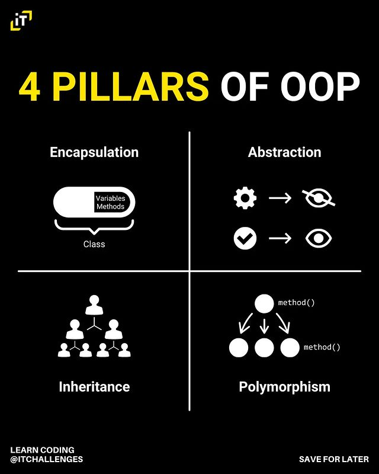
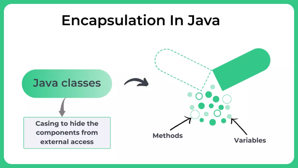
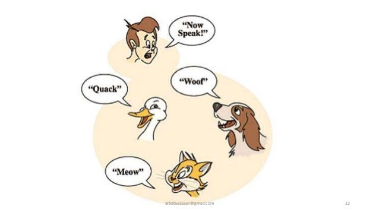
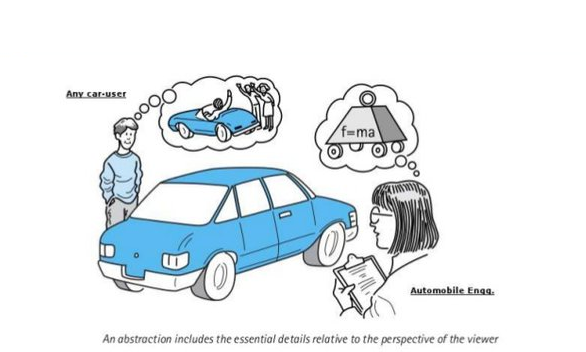

# Object-Oriented Programming (OOP) in Java

## The 4 Pillars of OOP



Object-Oriented Programming is based on four fundamental concepts known as the "four pillars." These are:

### 1. Encapsulation

Encapsulation involves hiding internal implementation details and protecting data using access modifiers such as `private`, `public`, and `protected`. This helps control access to class members and prevents unwanted modifications.



### 2. Inheritance

Inheritance allows the creation of a new class using properties and behaviors of an existing class. The existing class is called the base or parent class, and the new class is called the derived or child class. This encourages code reuse and establishes a class hierarchy.


### 3. Polymorphism

Polymorphism allows objects of different classes to be treated as objects of the same base class. This is achieved through the implementation of methods with the same name in different classes. There are two types of polymorphism: static (overloading) and dynamic (overriding).



### 4. Abstraction

Abstraction involves representing only the essential aspects of an object and hiding unnecessary details. This is achieved through the use of interfaces and abstract classes that provide a general structure without specifying all implementation details.



## Application of Concepts in the Code

### Encapsulation Example

- **Player.java:** The `private` modifier is used on the `name` and `health` fields to encapsulate the internal details of the `Player` class implementation.


### Inheritance, Polymorphism, and Abstraction Example

- **Character.java:** The base class `Character` has a `displayInfo()` method that is inherited by the `Player` and `Enemy` classes.

```java
// Character.java
public class Character {
  protected String name;
  protected int health;

  public Character(String name, int health) {
    this.name = name;
    this.health = health;
  }

  public void displayInfo() {
    System.out.println("Name: " + name + ", Health: " + health);
  }

  // Common method for both Player and Enemy to perform an action
  public void atack() {
    System.out.println(name + " is performing an action!");
  }
}

```


```java
// Enemy.java
public class Enemy extends Character {
  public Enemy(String name, int health) {
    super(name, health);
  }

  // Overriding the performAction method for Enemy (Polymorphism)
  @Override
  public void atack() {
    System.out.println(name + " is attacking with claws!");
  }

  // Method specific to Enemy class (Abstraction)
  public void defend() {
    System.out.println(name + " is defending!");
  }
}

```
- **Player.java and Enemy.java:** They use inheritance (extend from `Character`), implement polymorphism by overriding the `performAction()` method, and apply abstraction by providing specific methods (`useSkill()` and `defend()` respectively).

```java
// Player.java
public class Player extends Character {
  public Player(String name, int health) {
    super(name, health);
  }

  // Overriding the performAction method for Player (Polymorphism)
  @Override
  public void atack() {
    System.out.println(name + " is attacking!");
  }

  // Method specific to Player class (Abstraction)
  public void useSkill(String skill) {
    System.out.println(name + " is using " + skill + "!");
  }
}

```
- **RPGGameInheritance.java and RPGGamePolymorphism.java:** Both programs use polymorphism by treating objects of `Player` and `Enemy` as objects of the base class `Character`.

```java
// RPGGamePolymorphism.java
public class RPGGamePolymorphism {
  public static void main(String[] args) {
    Character[] characters = new Character[3];
    characters[0] = new Player("Hero", 100);
    characters[1] = new Enemy("Dragon", 150);
    characters[2] = new Player("Wizard", 120);

    for (Character character : characters) {
      character.displayInfo();

      // Performing a common action (Polymorphism)
      character.atack();
    }
  }
}

```
# Sources
- https://chat.openai.com/
- https://www.geeksforgeeks.org/four-main-object-oriented-programming-concepts-of-java/